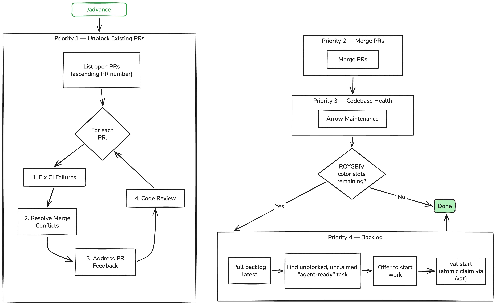

Skills I use on a daily basis (at least the ones I feel are worth sharing):

## [/advance](./advance/SKILL.md)

[/advance](./advance/SKILL.md) skill allows many PR's to be automatically advanced towards merge by an orchestrator agent. It relies on [gbiv](https://github.com/jmbeach/gbiv) for orchestration, [vat](https://github.com/jmbeach/vat) for task management, and [LID](https://github.com/jszmajda/lid) for spec-driven development. It lets the work flow through a state machine where it unblocks PR's to get them to a mergeable state. Requires the human to actually get the PR's open.

